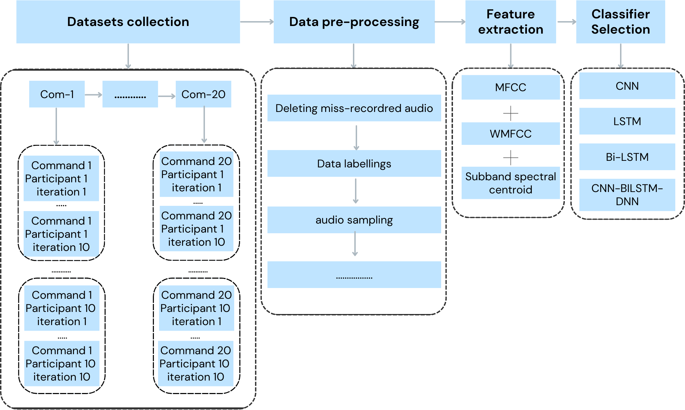
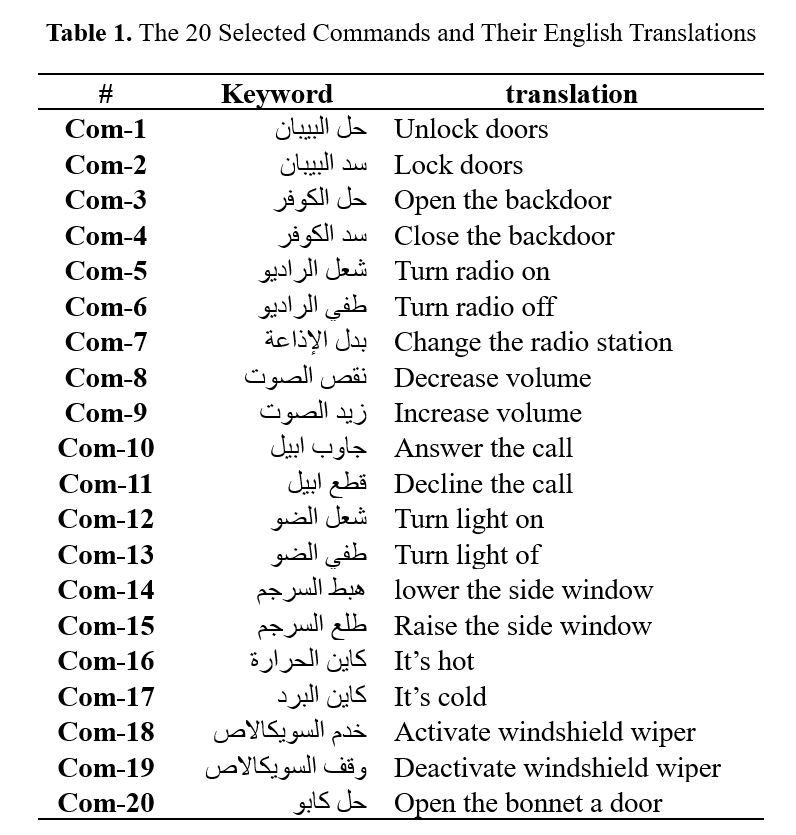

# Automative-Morrocan-Arabic-Speech-Command-Datset
In this repository, you will find the dataset used for building the first automotive speech recognition system in the Arabic dialect, specifically the Moroccan dialect.   
The dataset includes 20 commonly used in-car commands, carefully selected to aid Arabic drivers in making their driving experience comfortable and safe by reducing the distraction ratio.

### The Moroccan Arabic Speech Command Dataset (MASCD) Description

The Moroccan Arabic Speech Command Dataset (MASCD) was curated to develop a robust Speech Recognition system capable of identifying in-car voice commands in the Moroccan Arabic language.

#### Dataset Details:
- **Format:** (X, Y), where X represents the audio (input) and Y denotes the label of the audio.
- **Classes:** The dataset comprises 20 command classes.
- **Total Audio Files:** 2800 labeled audio samples.
- **Audio Length:** Each audio file is approximately two seconds long.
- **Sampling Rate:** 16 kHz with 16 bits per sample and mono channel.
- **Noise Level:** 25% of the audios were recorded in noisy conditions (e.g., cars, roads, traffic noise), while 75% were recorded in clean environments.
- **Repetitions:** Each command was recorded 10 times by 14 contributors, resulting in a total of 140 audio files per command.
- **Total Size:** The dataset size is approximately 180 MB.
This dataset is designed to facilitate a seamless driving experience for Arabic speakers and assist individuals with disabilities. Additionally, our goal is to contribute to the advancement of voice-controlled systems in the Arabic dialect language.

## Dataset Structure
The built datset is presented in the dataset file in the repesotory. 
there are 14 file, each one contain the recording of each  contributors.    
each contributors file contain 10 sub-file which contain recording of each command 10 times. 
dataset file

Dataset file structure:    
  -> contributor-1   
     -> Command-1  
         -> Command-1 Repetition-1  
         ..  
         -> Command-1 Repetition-10  
    ...
    -> Command-20  
         -> Command-20 Repetition-1  
         ..  
         -> Command-20 Repetition-10  
  ...  
  -> contributor-14    
 
The methodology used in our paper is presented in the folloing flow shart  

## Command selected
The commands included in our paper total 20. To ensure relevance and utility, we conducted a survey involving 12 participants and investigated well-established commands commonly used in cars.   
The selected commands, along with their translations from Arabic to English, are listed in the tables below.   
  

# Note :
The dataset used in this research is currently in use and not publicly available. 
However, authors interested in utilizing this dataset or our codes for research purposes are welcome to do so. 
Please send an email to my official account, and I will gladly provide you with access to these resources.

my email : soufiyane.ouali@usmba.ac.ma
